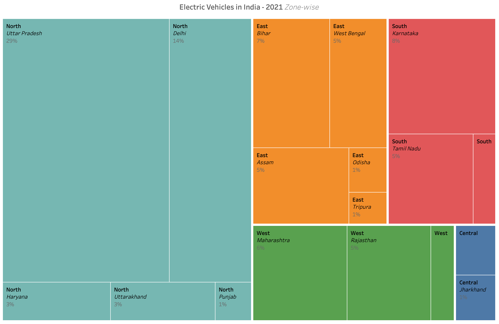
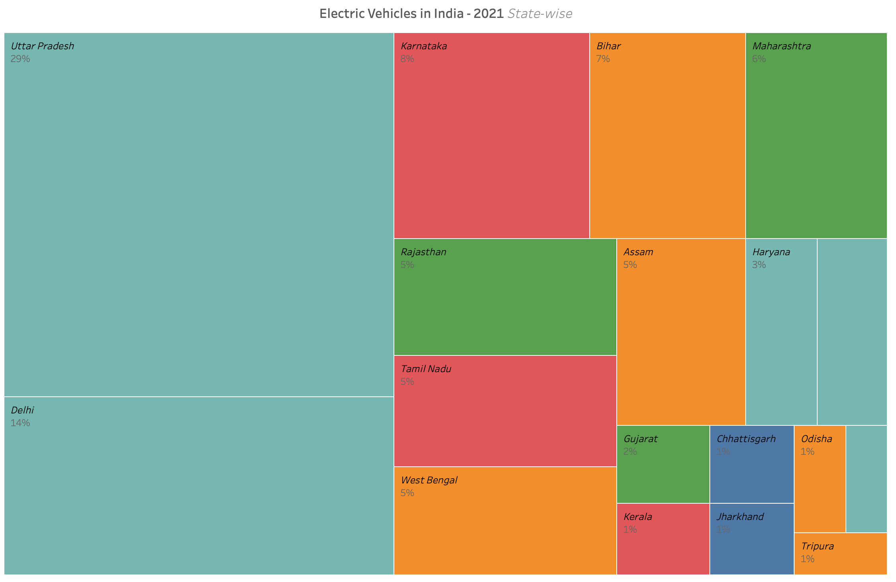
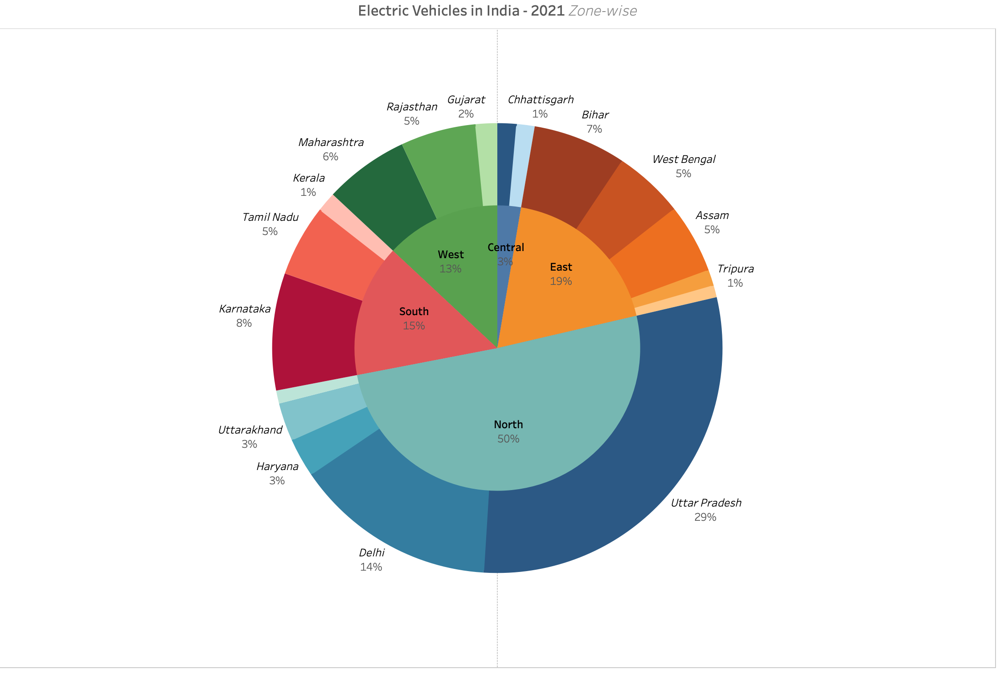
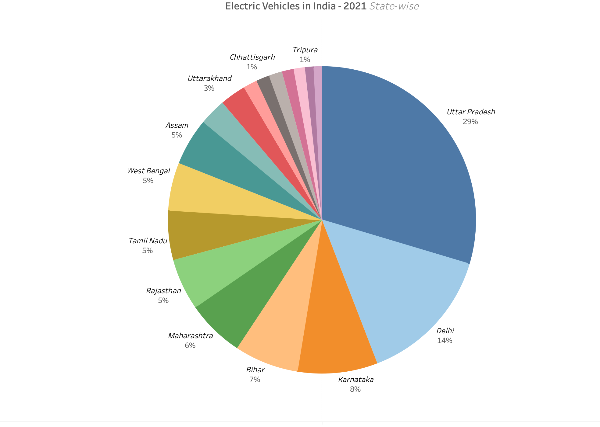

# electricvehicles

In recent times the usage of Electric Vehicles (EV) has increased in India. The attempt here is to understand how the adoption to the Electric Vehicles is across Zones and States. Do note that these are absolute numbers. It would probably be better to compare the number of EVs per 1000 people in each state/zone.

The treemaps do show the distribution of EVs across the zones and states. But it is a tad difficult to navigate the treemap - left to right & top to bottom.

On the other hand the sunburst charts make this very clear (in both zone and state cases) in a single glance. Navigation is clockwise which is simple and intuitive.

Both these charts are good as long as the number of categories is small and the difference in the values across these categories is considerable. Between the two charts the sunburst charts look better and also help (in sending the message across) better.

This was my [submission](https://community.storytellingwithdata.com/challenges/october-2022-tree-mendous-treemaps/electric-vehicles-in-india) to the Storytelling with Data's [visualize vacation October 2022 challenge](https://community.storytellingwithdata.com/challenges/october-2022-tree-mendous-treemaps#accept-challenge) I used Tableau and datasets from [data.gov in](https://data.gov.in/resource/stateut-wise-details-electric-vehicles-reply-unstarred-question-08-december-2021) site

